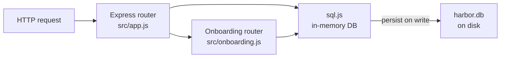
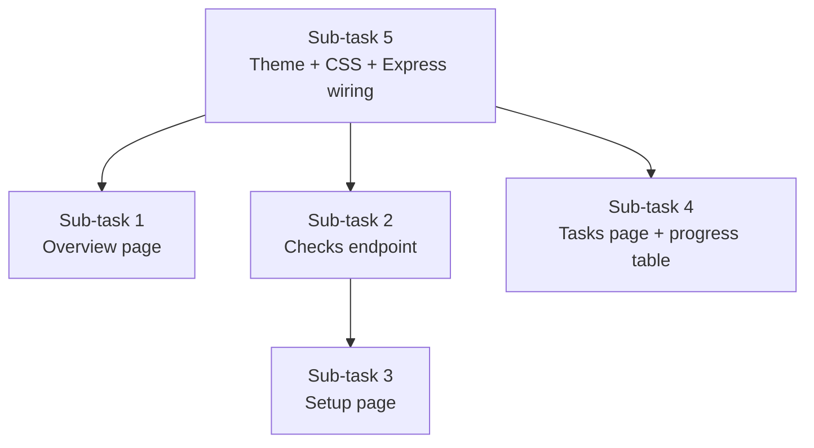

# Plan only. Do not edit files.

Using @PROJECT.md @README.md @docs/RUNBOOK.md and the source, plan FirstHour onboarding:
1. Architecture explanation a new hire can read in two minutes.
2. Setup checks: node version >= 20, .env exists, PORT is an integer 1024-65535, DB_PATH parent folder is writable, GET /api/health succeeds within 3 seconds.
3. Five starter tasks a new hire can do in under an hour. Each task names the file to edit and how to prove it worked.
4. UI pages: Overview, Setup, Starter tasks. Dark, light, and system theme saved in localStorage. If the saved value is anything else, use system.
5. SQLite table onboarding_progress(task_id, status, updated_at).

List files you will add. Do not write them yet.

---

**Status:** active  **Date:** 2026-09-25

---

### 👤 User

Plan only. Do not edit files.

Using @PROJECT.md @README.md @docs/RUNBOOK.md and the source, plan FirstHour onboarding:
1. Architecture explanation a new hire can read in two minutes.
2. Setup checks: node version >= 20, .env exists, PORT is an integer 1024-65535, DB_PATH parent folder is writable, GET /api/health succeeds within 3 seconds.
3. Five starter tasks a new hire can do in under an hour. Each task names the file to edit and how to prove it worked.
4. UI pages: Overview, Setup, Starter tasks. Dark, light, and system theme saved in localStorage. If the saved value is anything else, use system.
5. SQLite table onboarding_progress(task_id, status, updated_at).

List files you will add. Do not write them yet.

---

### 🤖 Assistant

> 🔧 called: use_skill

> 🔧 **use_skill** — create-plan

### 🤖 Assistant

> 🔧 called: spawn_subagent

Now let me research the codebase in parallel with reading the referenced documents.

> 🔧 **spawn_subagent** — explore

### 🤖 Assistant

> 🔧 called: read_file, read_file

Excellent — I now have everything I need. Let me read PROJECT.md and the RUNBOOK directly to capture the full spec text before writing the plan.

> 🔧 **read_file** — PROJECT.md

> 🔧 **read_file** — docs/RUNBOOK.md

### 🤖 Assistant

> 🔧 called: write_file

Now I have full context. Let me write the plan file.

> 🔧 **write_file** — onboarding-plan.md

### 🤖 Assistant

Here is the plan — nothing has been written to the source tree yet.

---

## Plan Summary

### What gets built

Five sub-tasks, two file types: **6 new files** + **2 small additions** to existing files.

| File | New / Modified |
|------|---------------|
| [`src/onboarding.js`](onboarding-plan.md) | **New** — Express router: 3 page routes + `/api/onboarding/checks` + progress API |
| [`public/onboarding.css`](onboarding-plan.md) | **New** — CSS custom-property theme tokens |
| [`public/theme.js`](onboarding-plan.md) | **New** — `localStorage` theme read/write + toggle button |
| [`views/overview.html`](onboarding-plan.md) | **New** — Architecture explanation page |
| [`views/setup.html`](onboarding-plan.md) | **New** — Setup checks page |
| [`views/tasks.html`](onboarding-plan.md) | **New** — Starter tasks + progress badges |
| [`src/db.js`](onboarding-plan.md) | **Modified** — add `onboarding_progress` DDL |
| [`src/app.js`](onboarding-plan.md) | **Modified** — mount router + `express.static('public')` |

---

### Architecture flow the Overview page will explain

---

### Sub-task order

Recommended order: **5 → 1 → 2 → 3 → 4**

---

### The five setup checks

| # | Check | Pass condition |
|---|-------|---------------|
| 1 | Node version | `process.versions.node` major ≥ 20 |
| 2 | `.env` file exists | `fs.existsSync('.env')` |
| 3 | `PORT` is 1024–65535 | `parseInt(process.env.PORT)` in range |
| 4 | `DB_PATH` parent is writable | `fs.accessSync(dir, fs.constants.W_OK)` |
| 5 | `GET /api/health` < 3 s | internal `http.get` with 3000 ms timeout |

---

### The five starter tasks

| # | Title | File | Proof |
|---|-------|------|-------|
| 1 | Add a new customer to seed data | [`src/db.js`](src/db.js) | `GET /api/orders` shows the new customer |
| 2 | Raise max quantity from 20 → 50 | [`src/app.js`](src/app.js) | `POST` with `quantity: 35` returns 201 |
| 3 | Add `GET /api/orders/:id` | [`src/app.js`](src/app.js) | `curl .../api/orders/1` returns one order |
| 4 | Add `"delivered"` status + `shipped → delivered` | [`src/app.js`](src/app.js) | PATCH a shipped order to `delivered` → 200 |
| 5 | Log DB path and port on startup | [`src/server.js`](src/server.js) | `npm start` prints both values |

---

### Theme rules

- `localStorage.theme === "dark"` → add class `dark` to `<html>`
- `localStorage.theme === "light"` → add class `light` to `<html>`
- Anything else (including `"system"`, `""`, `null`, or missing) → **no class set**, CSS `@media (prefers-color-scheme: dark)` handles it
- Toggle cycles: light → dark → system (removes the class)

---

A few questions to confirm before implementation:

1. **Routing root:** Should `GET /` redirect to `/onboarding/overview`, or should the orders API remain at root and the onboarding UI live only under `/onboarding/*`?
2. **Starter tasks — task 4 (new status):** Adding `"delivered"` changes the live API behaviour. Is that acceptable for a learning exercise, or should the task be scoped to a non-breaking change (e.g. add a `GET /api/orders/stats` route instead)?
3. **Progress persistence:** The `onboarding_progress` table uses the existing sql.js in-memory + `persist()` pattern. Is that the right call, or should progress reset on every server restart (i.e. no table, just `localStorage`)?